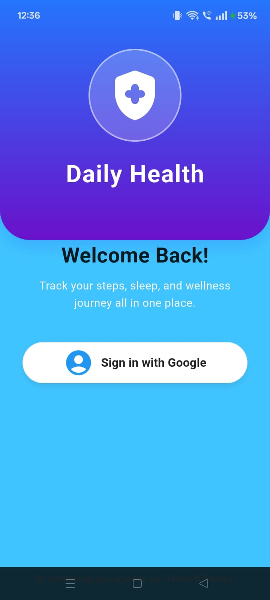
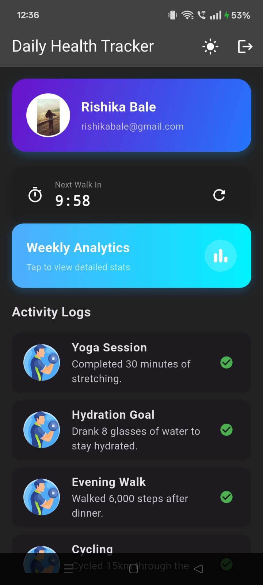

**Daily Health Tracker**-
A Flutter app built to monitor your everyday health habits. This project highlights skills such as GetX State Management, MVC Architecture, REST API Integration, Google Authentication, and Data Visualization.
**Tech Stack**

Framework: Flutter

Language: Dart

State Management: GetX

Authentication: firebase_auth
 & google_sign_in

Networking: http

Charting: fl_chart

**Folder Stucture**
lib/
├── models/
├── views/
├── controllers/
├── services/
├── routes/
├── widgets/
├── utils/
└── main.dart

**Implemented Features**
1. Authentication

Google Sign-In: Provides secure login using Firebase.

Profile Management: Shows the user’s Avatar, Name, and Email on the dashboard.

Modern Login Interface: Features a custom animated entry screen with a gradient background.

2.Dashboard & Analytics

Visual Insights: Displays an interactive weekly progress bar chart using fl_chart.

Detailed Analytics Page: A separate screen dedicated to in-depth activity stats.

Data Mapping: Converts raw API data into clear, user-friendly Health Activity records (e.g., “Morning Jog”, “Hydration”).

3. Performance & Logic

Lazy Loading: Infinite scroll list powered by JSONPlaceholder API.

MVC Architecture: Maintains clean separation of logic using Controllers, Models, and Views.

Countdown Timer: Includes a 10-minute activity timer with Auto-Refresh and Manual Reset options.

4. UI/UX Design

Animations: Smooth fade and scale effects for list items via TweenAnimationBuilder.

Dark Mode: Full theme toggle between light and dark modes.

Responsive Layout: Adjusts gracefully to different screen sizes for a neat and minimal interface.

**Setup Instructions**

Follow these steps to set up the project locally:

1. Clone the Repository
git clone https://github.com/Rishikabale/Daily_health_tracker
cd daily_health_tracker

2. Install Dependencies
flutter pub get

3. Firebase Setup (Important)

This app uses Firebase for Google Sign-In.

Ensure the google-services.json file is located in android/app/.

If it’s missing, generate your SHA-1 key and register the app on the Firebase Console
 to get the file.

4. Run the App
flutter run

📸 App Screenshots

| Login Screen | Dashboard | Analytics |
|:---:|:---:|:---:|
|  |  |  |
